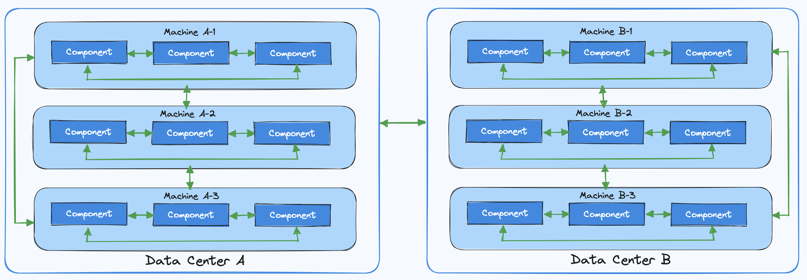
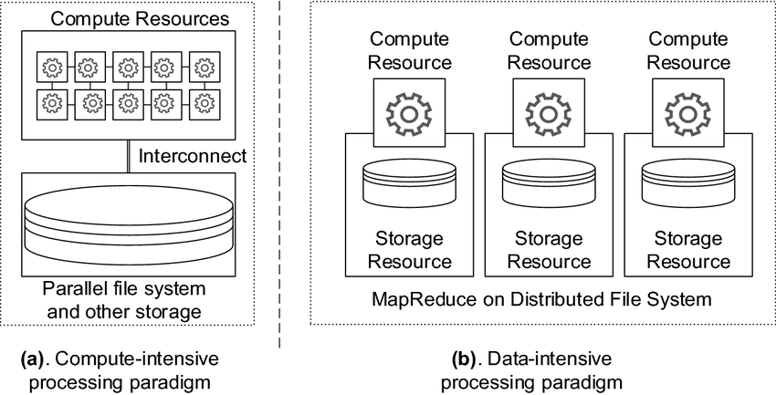
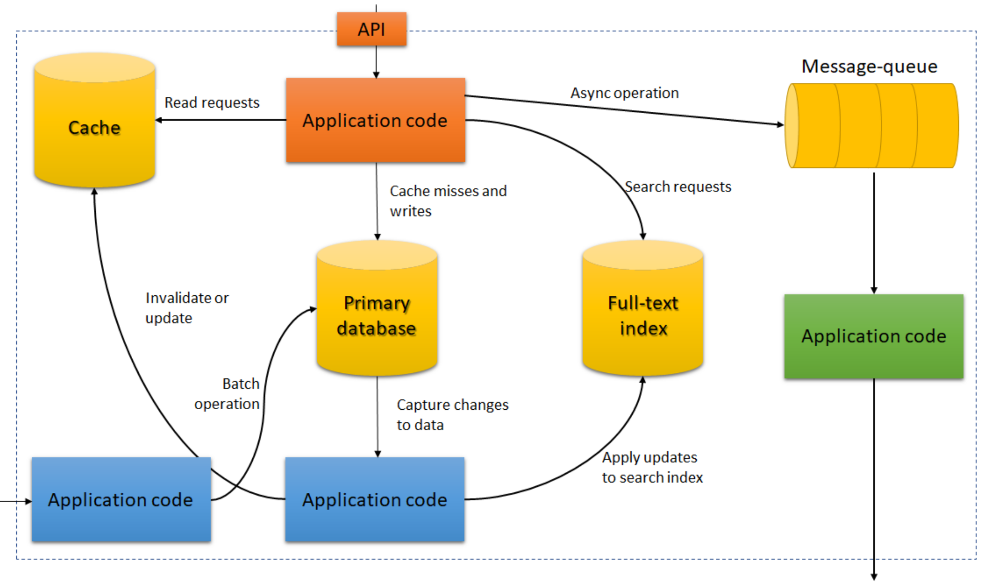

# Методические материалы курса "Разработка распределённых программных систем"

Документ содержит необходимые методические материалы для прохождения курса "Разработка распределённых программных
систем".

## Оглавление

1. [Введение](#введение)
2. [Основы распределённых программных систем](#1-основы-распределённых-программных-систем)
3. [Процессы и потоки](#2-процессы-и-потоки)
4. [Протоколы взаимодействия](#3-протоколы-взаимодействия)
5. [Быстродействие и надёжность распределённых систем](#4-быстродействие-и-надёжность-распределённых-систем)
6. [Чат-боты](#5-чат-боты)
7. [Разработка проекта и подготовка к собеседованиям](#6-разработка-проекта-и-подготовка-к-собеседованиям)

## Введение

Современный мир невозможно представить без непрерывной работы распределённых программных систем различной сложности.
Абсолютное большинство людей пользуется их возможностями, даже не задумываясь об этом. Будь то приложение банка в Вашем
мобильном устройстве или веб-сайт любимого интернет-магазина в браузере Вашего компьютера - всё это лишь вершина
айсберга, которая скрывает за собой сотни и тысячи компонентов, трудящихся над решением Ваших ежедневных проблем.

Ключевой проблемой современных распределённых программных систем стал **объём данных и трафика** (например, картинок с
котиками), который необходимо обрабатывать с минимальными задержками и высокой доступностью.

За последние десятилетия наши коллеги очень сильно постарались над тем, чтобы эти системы работали _надёжно_ (иначе
Ваши картинки с котиками однозначно бы потерялись), их было легко _масштабировать_ (иначе Вы бы не дождались своих
картинок с котиками) и удобно _сопровождать_ (иначе новые картинки с котиками пересылали бы почтой).  
Благодаря их усилиям появились новые инструменты, разработанные как такими техническими гигантами, как Google и
Microsoft, так и небольшими группами энтузиастов.

К счастью, за быстрой сменой технологий стоят принципы, остающиеся актуальными вне зависимости от используемой версии
конкретного инструмента. Если Вы понимаете эти принципы, то сможете разобраться, где и как можно применить тот или иной
инструмент.

Цель курса - обучить принципам разработки распределённых программных систем на практике и помочь Вам проложить путь по
многоликому и быстро меняющемуся ландшафту технологий для обработки и хранения данных.

Мы рассмотрим внутреннее устройство распределённых программных систем, разберёмся в ключевых алгоритмах, обсудим их
принципы и неизбежные компромиссы. В процессе попытаемся выявить удобные _подходы_ к распределённым системам - не
только к тому, _как_ они работают, но и _почему_ они работают именно так, а также какие вопросы необходим задать себе о
них.

Важной частью курса является изучение примеров успешно работающих распределённых программных систем: технологий, которые
составляют фундамент для множества популярных приложений. Кроме того, мы разберём примеры того, как наши коллеги
работают с постановкой задачи на разработку распределённой программной системы, в том числе в условиях собеседования, и
попытаемся предложить свои улучшения для их решений.

Курс состоит из 6 разделов:

1. [Основы распределённых программных систем](#1-основы-распределённых-программных-систем)

Раздел призван познакомить и/или освежить знания слушателей в теоретических знаниях о разработке распределённых
программных систем и помочь начать разработку первого компонента распределённой системы.

2. [Процессы и потоки](#2-процессы-и-потоки)

Раздел призван познакомить и/или освежить знания слушателей в знаниях о многопоточном и асинхронном
программировании, которые необходимы для успешной работы компонентов распределённой программной системы. Практическим
результатом раздела является превращение синхронного компонента из раздела 1 в асинхронный/многопоточный.

3. [Протоколы взаимодействия](#3-протоколы-взаимодействия)

Раздел призван познакомить слушателей с возможными протоколами взаимодействия компонентов распределённой
программной системы. Практическим результатом данного раздела является превращение компонента из разделов 1 и 2 в
сервис, предоставляющий RESTful/JSON-RPC/GraphQL/gRPC API, и добавление ещё одного или нескольких компонентов,
общающихся с ним по выбранному протоколу.

4. [Быстродействие и надёжность распределённых систем](#4-быстродействие-и-надёжность-распределённых-систем)

Раздел призван познакомить слушателей с возможными методами обеспечения быстродействия, надёжности,
масштабируемости, качества и удобства сопровождения распределённых программных систем. Практическим результатом раздела
является применение совокупности этих методов к компонентам из разделов 1-3.

5. [Чат-боты](#5-чат-боты)

Раздел призван познакомить слушателей с разработкой чат-ботов как одним из классов распределённых систем,
пользующегося популярностью в современном мире. Практическим результатом раздела является разработанный на основе знаний
из разделов 1-5 чат-бот для выбранной площадки обмена сообщениями.

6. [Разработка проекта и подготовка к собеседованиям](#6-разработка-проекта-и-подготовка-к-собеседованиям)

Раздел призван помочь слушателям разработать итоговый проект и разобрать несколько кейсов проектирования распределённых
систем на практике. Практическим результатом раздела является успешно разработанный и запущенный слушателем итоговый
проект.

## 1. Основы распределённых программных систем

Раздел содержит информацию об определении, свойствах, особенностях
проектирования и разработки распределённых программных систем.

### 1.1 Определение распределённых систем

Дать точное определение, что такое _распределённая программная система_ весьма непростая задача. Одним из возможных
вариантов определения может быть выражен через основные свойства распределённых программных систем.

Распределённая программная система:

* Состоит из **множества компонентов**, обменивающихся между собой сообщениями для достижения некоторой общей цели.
* Со стороны внешнего агента представляется как **единое целое**. То есть компоненты _инкапсулированы_ внутри системы.
* Компоненты распределённой программной системы могут находиться на **различных** вычислительных узлах (компьютерах),
  которые в свою очередь могут находиться в различных дата-центрах по всему миру.

Исходя из этих свойств, мы можем сформулировать следующее определение:

**Распределённая программная система** - это множество компьютерных программ, использующих вычислительные ресурсы
нескольких отдельных вычислительных узлов для достижения одной общей цели.

Внимательные читатели могут заметить, что под это определение подходит, например, система, которая занимается
параллельным выполнением некоторой сложной вычислительной операции, такой как перемножение матриц. Такие системы принято
называть _высоконагруженными вычислениями_ (compute-intensive), для них важна чистая производительность CPU/GPU и
вопросы их разработки останутся за рамками данного курса.  
Нас же интересуют распределённые программные системы _высоконагруженные данными_ (data-intensive), для которых
производительность CPU/GPU зачастую просто ограничивающий фактор. Основная проблема таких систем - это **объём данных**,
их **сложность** и **скорость изменений**.

Таким образом, итоговое определение может выглядеть так:

**Распределённая программная система** - это множество компьютерных программ, использующих вычислительные ресурсы
нескольких отдельных вычислительных узлов для достижения одной общей цели, _проблематика которой связана с объёмом
данных, их сложностью и скоростью изменений_.

### 1.2 Особенности проектирования и разработки распределённых систем

Приятной особенностью проектирования и разработки распределённых систем является тот факт, что обычно они создаются из
стандартных блоков, обеспечивающих часто требующуюся функциональность. Например, многим приложениям нужно:

* хранить данные, чтобы эти или другие приложения могли найти их в дальнейшем (_базы данных_);
* запоминать результат ресурсоёмкой операции для ускорения чтения (_кэш_);
* предоставлять пользователям возможность искать данные по ключевому слову или фильтровать их различными способами (
  _поисковые индексы_);
* отправлять сообщения другим процессам для асинхронной обработки (_потоковая обработка_);
* время от времени обрабатывать большие объёмы накопленных данных (_пакетная обработка_);

### 1.3 Проблемы распределённых систем

### 1.4 Модели данных и языки запросов

### 1.5 Системы хранения и извлечения данных

## 2. Процессы и потоки

TBD

## 3. Протоколы взаимодействия

TBD

## 4. Быстродействие и надёжность распределённых систем

TBD

## 5. Чат-боты

TBD

## 6. Разработка проекта и подготовка к собеседованиям

TBD