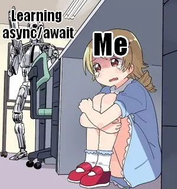

# Практическая работа №1

## Цель

Применить async к Вашей DSS и подключить хранилище данных.

## Задачи

1. Подключить async-runtime к Вашей DSS.
2. Подключить выбранную в [П0](./practice0.md) СУБД к Вашей DSS (InMemoryUserRepository -> MySQLUserRepository).
3. Явно выделить слои Вашей DSS и отразить их в коде:
   1. Выбранный фреймворк (api endpoints, console app, etc.)
   2. Application (принимает и возвращает DTO)
   3. Domain (принимает Command, возвращает Event)*
   4. Infrastructure (реализация Repository, доступ к внешним сервисам, СУБД)
   5. Util (логирование и т.д.)**
4. Обновить или написать необходимые тесты.
5. Сформировать первичные Dockerfile и docker-compose Вашей DSS и её инфраструктуры (на основе шаблона).

Примечания:

\* В случае синхронных вызовов и, если Вы не планируете использовать паттерн CQRS (обоснуйте, почему он не подходит для Вашей системы), можно возвращать ValueObject, который потом смаппить в DTO.

\** Слой необязательный.

## Требования

1. Код должен быть покрыт автотестами (unit, integration, e2e).
2. Обращения к внешним системам (в т.ч. СУБД) должны быть асинхронными.

## Формат сдачи проекта

1. Оформить описание работ в отчете с описанием того, что было сделано и что не получилось сделать. Добавить скриншоты, демонстрирующие успешную работу разработанных функций. Добавить листинги кода и ссылку на репозиторий проекта.
2. Отправить в телеграм t.me/FilaCo (можно ссылкой на GitHub/GitLab репозиторий).
