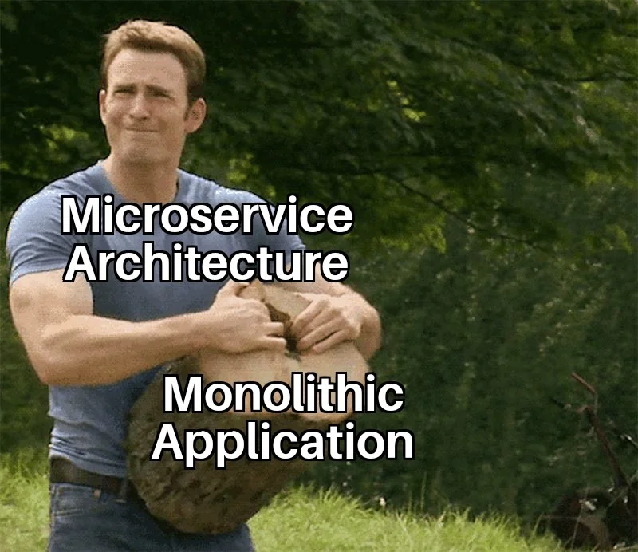

# Практическая работа №2

<picture>
    
</picture>

## Цель

Распилить Вашу DSS на сервисы.

## Задачи

1. Определить API Вашей DSS:
   1. Синхронный (RPC) или асинхронный (Event-based)? (Обосновать)
   2. Реализовать его с помощью выбранного фреймворка
2. Разделить Вашу систему на сервисы:
   1. Ограниченные контексты, выделенные в [П0](./practice0.md) - это буквально Ваши сервисы.
   2. Определить и реализовать интерфейсы сервисов (также как и для всей системы в п.1).
3. Обернуть сервисы в Dockerfile и обновить docker-compose.
4. Обновить или дописать необходимые тесты.
5. Подумать над выделением шаблонного репозитория.

## Требования

1. Код должен быть покрыт автотестами (unit, integration, e2e).
2. Обращения к внешним системам (в т.ч. СУБД) должны быть асинхронными.
3. Не менее 3 микросервисов (включая общий API DSS).
4. Один из микросервисов должен быть потоковым обработчиком задач (consumer).
5. Код всех микросервисов должен быть покрыть линтерами и статическими анализаторами.

## Формат сдачи проекта

1. Оформить описание работ в отчете с описанием того, что было сделано и что не получилось сделать. Добавить скриншоты, демонстрирующие успешную работу разработанных функций. Добавить листинги кода и ссылку на репозиторий проекта.
2. Отправить в телеграм t.me/FilaCo (можно ссылкой на GitHub/GitLab репозиторий).
